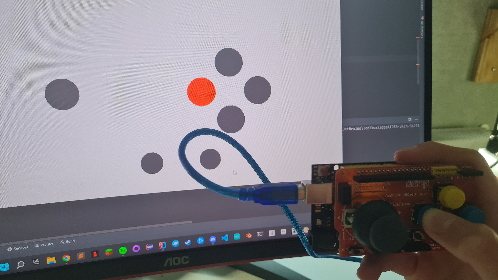
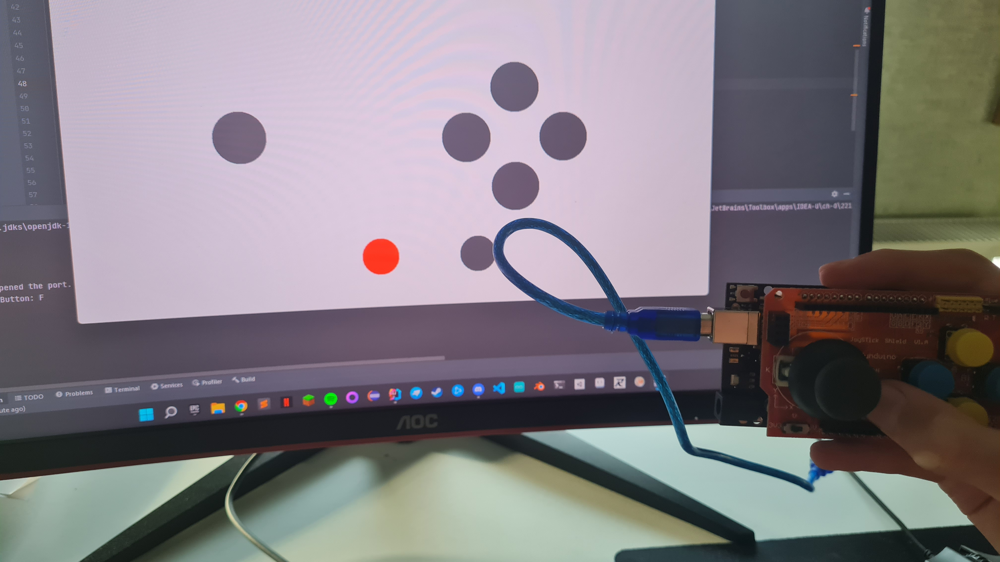
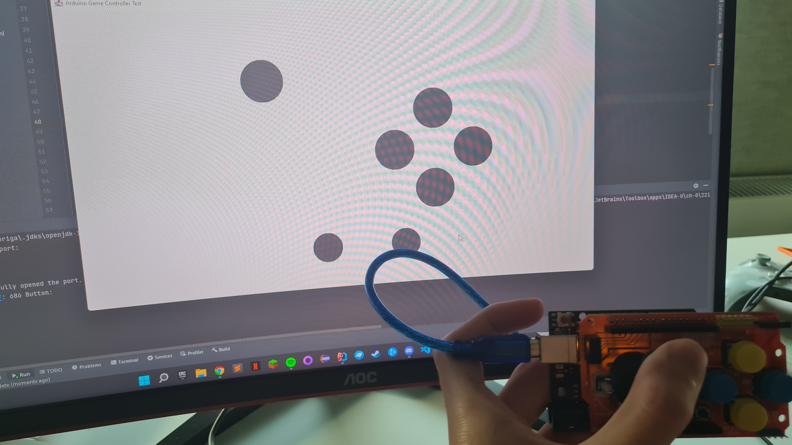
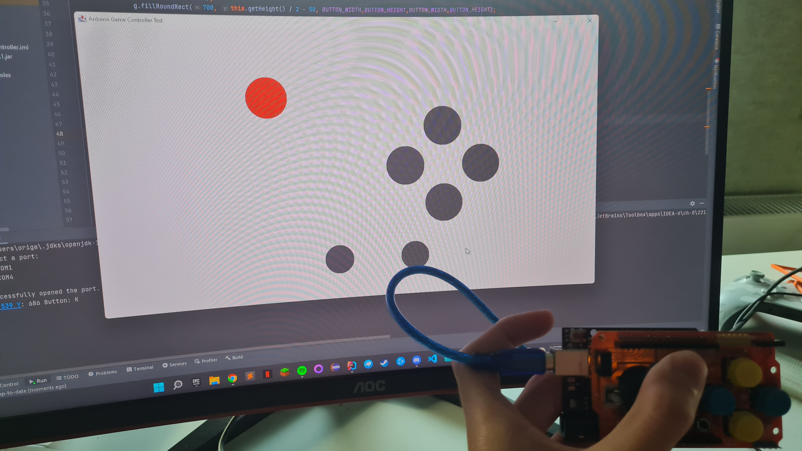

# Arduino Game Controller

Für diese Projekt habe ich ein Arduino Sketch geschrieben, welcher Daten über den Controller auf der "Serial Console" ausgibt und ein Java Programm, welches diese Daten mithilfe einer Bibliothek (.jar) ausliest und mittels einer GUI als Controller Inputs anzeigt.

Als Controller verwende ich hier einen Arduino Uno mit dem [Joystick Shield von Funduino](https://funduinoshop.com/elektronische-module/keypads-und-buttons/joysticks/joystick-shield-v1.a-arduino-uno-kompatibel), welchen man einfach auf den Arduino Uno stecken kann.

Das fertige Programm, welches die Inputs visualisiert, sieht am Ende so aus:

Button D wird gedrückt

Button F wird gedrückt

Joystick wird bewegt

Joystick wird bewegt und gedrückt

Hier ein Video des Programmes in Action:

https://user-images.githubusercontent.com/92476790/169709611-391773cb-4f6e-4965-9c85-765eb3f42c3b.mp4

